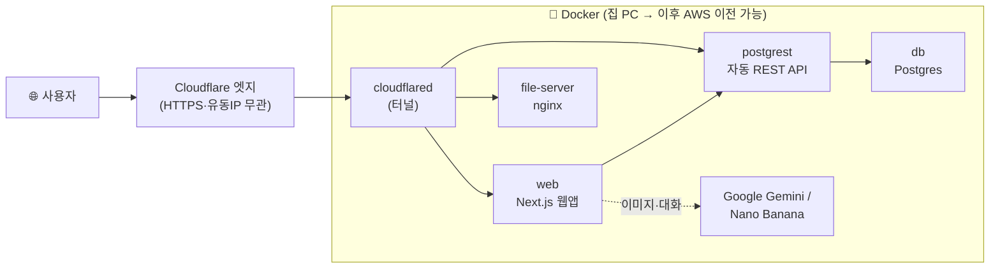

# 🎨 키네틱 아트 스튜디오 (kineticart)

> **키네틱 아트 갤러리를 보며 AI와 대화 → 참조 작품 선택 → 새 이미지 생성 → 3D 모델 다운로드**
>
> 전부 **개인 PC(또는 외부 서버)에서 Docker로 자체호스팅**하고, **Cloudflare Tunnel**로 외부에 안전하게 노출합니다. 이미지 생성·3D 외에는 **전액 무료**이며, 컨테이너 묶음이라 **AWS 등으로 그대로 이전** 가능합니다.

---

## ✨ 주요 기능

| # | 기능 | 설명 |
|---|---|---|
| 1 | **작품 파일 서버** | 원본 이미지·한글 설명을 정적 서빙 (nginx) |
| 2 | **자동 REST API** | 메타데이터 DB(Postgres) → PostgREST가 REST API 자동 생성 |
| 3 | **스케일러블 갤러리** | 검색·태그/작가/연대 필터·무한스크롤 (수천 개 대비) |
| 4 | **AI 창작 대화 (RAG)** | 참조 작품을 근거로 Gemini와 대화하며 컨셉 구체화 |
| 5 | **이미지 생성** | 참조 이미지 + 대화 컨셉을 Nano Banana로 융합 → 새 키네틱 아트 |
| 6 | **3D 생성** *(예정)* | 생성 이미지 → Tripo AI → GLB 3D 모델 다운로드 |
| 🔒 | **비밀번호 게이트** | 웹앱 전체 로그인 보호 (이미지 생성 비용 악용 방지) |
| 🔎 | **의미검색 준비(임베딩)** | 작품 한글 설명을 로컬 임베딩(무료)해 향후 벡터 기반 의미검색 대비 — 파이프라인 5b단계 |

---

## 🏗️ 아키텍처

한 개의 `docker-compose.yml`로 **컨테이너 5개**를 띄우고, Cloudflare Tunnel이 도메인과 연결합니다.



```
인터넷 → Cloudflare 엣지 → cloudflared 터널 → Docker
  www.도메인    → web        (Next.js 15, 비밀번호 게이트)
  api.도메인    → postgrest  → db (Postgres, 외부 비노출)
  images.도메인 → file-server(nginx: /works /texts /generated)
```

| 컨테이너 | 이미지 | 역할 | 로컬 포트 |
|---|---|---|---|
| `file-server` | nginx:alpine | 원본/생성 이미지·텍스트 서빙 | 8787 |
| `db` | postgres:16-alpine | 메타데이터 DB (외부 비노출) | (내부 5432) |
| `postgrest` | postgrest/postgrest | 자동 REST API (읽기전용) | 3001→3000 |
| `web` | Next.js standalone | 웹앱 (갤러리·대화·생성) | 3002→3000 |
| `cloudflared` | cloudflare/cloudflared | 외부 노출 터널 | — |

**기술 스택**: Next.js 15 (App Router) · React 19 · TypeScript · Tailwind · Postgres 16 · PostgREST · nginx · Docker Compose · Cloudflare Tunnel · Google Gemini(대화·이미지).

---

## 🚀 빠른 시작 (Docker)

### 요구사항
- **Docker Desktop** (또는 Docker Engine + Compose v2)
- (선택, 외부 공개용) 도메인 + Cloudflare 계정
- (선택, 대화/이미지) Google AI Studio API 키

### 1. 클론
```bash
git clone https://github.com/xenonluv/kineticart.git
cd kineticart
```

### 2. 환경변수 설정
```bash
cp .env.example .env
```
`.env`를 열어 값을 채웁니다. **랜덤 비밀값은 이렇게 생성**하면 편합니다:
```bash
# 예시 (원하는 값으로)
echo "POSTGRES_PASSWORD=$(openssl rand -hex 16)"      >> .env
echo "AUTHENTICATOR_PASSWORD=$(openssl rand -hex 16)" >> .env
echo "AUTH_TOKEN=$(openssl rand -hex 24)"             >> .env
# SITE_PASSWORD 는 원하는 로그인 비밀번호로 직접 지정
```
각 변수 설명은 아래 [🔑 환경변수](#-환경변수) 표 참고.

### 3. 빌드 + 실행 (전체 스택을 한 번에)
```bash
docker compose up -d --build
```
첫 실행 시 자동으로:
- 🏗️ `web`·`file-server` 이미지 빌드
- 🗄️ Postgres가 `db/init/`의 **스키마 + 시드(작품 69개)** 를 자동 적용
- ▶️ 컨테이너 5개 기동

### 4. 상태·접속 확인
```bash
docker compose ps           # 컨테이너 상태
docker compose logs -f web  # 로그
```
로컬 접속:
| URL | 내용 |
|---|---|
| http://localhost:3002 | 웹앱 (로그인: `.env`의 `SITE_PASSWORD`) |
| http://localhost:3001/kinetic_artworks | REST API (작품 메타) |
| http://localhost:8787/healthz | 파일서버 상태(`ok`) |

> **📌 작품 이미지 파일 참고**: 용량 문제로 원본 이미지(`works/`)는 이 저장소에 **포함되지 않습니다**. DB의 `image_url`은 공개 파일서버(`images.<도메인>`)를 가리킵니다. 자신의 이미지로 채우려면 `data-pipeline/`(수집 파이프라인)을 실행하거나 `works/`·`texts/`에 파일을 넣으세요.

### 주요 명령어
```bash
docker compose up -d --build web   # 코드 수정 후 web만 재빌드·재기동
docker compose restart postgrest   # DB 스키마 변경 후 REST 캐시 재로드
docker compose down                # 전체 중지 (볼륨 유지)
docker compose down -v             # 전체 중지 + DB 볼륨 삭제(초기화)
```
- **DB 스키마 변경**: `db/init/*`는 최초 1회만 자동 적용됩니다. 실행 중인 DB에는:
  ```bash
  docker exec -i kinerag-db psql -U postgres -d kinerag < db/init/01-search.sql
  docker compose restart postgrest
  ```

---

## 🌐 외부 노출 (Cloudflare Tunnel)

집 PC의 유동 IP·포트포워딩 없이 도메인으로 안전하게 공개합니다.

1. Cloudflare에 도메인 추가 → 네임서버 변경 (무료)
2. **Zero Trust → Networks → Tunnels → Create a tunnel** → 토큰을 `.env`의 `CLOUDFLARE_TUNNEL_TOKEN`에 입력
3. 터널 **Public Hostname(Routes)** 3개 추가:
   | Subdomain | Service URL |
   |---|---|
   | `images` | `http://file-server:8787` |
   | `api` | `http://postgrest:3000` |
   | `www` | `http://web:3000` |
4. `docker compose up -d` → `https://www.<도메인>` 로 접속

> 아웃바운드 터널이라 **공인 IP·고정 IP·포트포워딩 모두 불필요**하고, IP가 바뀌어도 자동 복구됩니다.

---

## 🔌 REST API 요약

**공개 메타 API** — `https://api.<도메인>` (PostgREST, 읽기전용)
```bash
GET /kinetic_artworks?select=*&order=created_year.desc   # 목록
GET /kinetic_artworks?title=ilike.*크로마*                # 검색
GET /kinetic_artworks?tags=cs.{모터}                      # 태그 필터
GET /tag_facets  /artist_facets  /decade_facets          # 필터 카운트
```
**웹앱 API** — `https://www.<도메인>/api/*` (로그인 필요)
`/api/artworks`(검색·페이지네이션) · `/api/facets` · `/api/artwork/[id]` · `/api/chat`(SSE 대화) · `/api/generate-image`(이미지 생성)

---

## 🗂️ 프로젝트 구조
```
kineticart/
├── docker-compose.yml     # 스택 전체 정의 (컨테이너 5개)
├── .env.example           # 환경변수 템플릿 (복사해서 .env 로)
├── file-server/           # nginx Dockerfile + 설정(CORS, /works /texts /generated)
├── db/init/               # 최초 기동 SQL: 스키마 + 시드(69작품) + 검색 인덱스
├── texts/                 # 작품 한글 설명 원문
├── dataset/               # 파이프라인 산출물(manifest.json·seed.sql·임베딩 포함 described.json)
├── data-pipeline/         # 데이터 수집 파이프라인 (Python, CC/오픈액세스만, 5b=로컬 텍스트 임베딩)
└── web/                   # Next.js 앱
    ├── app/               # page.tsx(스튜디오), login/, api/*
    ├── components/        # Studio, FilterRail, ArtworkGrid, ChatPanel …
    ├── lib/               # rest, llm, imagegen, useArtworks, types …
    └── middleware.ts      # 비밀번호 게이트
```

---

## 🔑 환경변수

`.env`에 설정 (템플릿: `.env.example`). **`.env`는 절대 커밋 금지** (`.gitignore` 등록됨).

| 키 | 용도 | 얻는 법 |
|---|---|---|
| `CLOUDFLARE_TUNNEL_TOKEN` | 터널 커넥터 | Cloudflare Zero Trust에서 터널 생성 시 |
| `POSTGRES_PASSWORD` | DB 비밀번호 | `openssl rand -hex 16` |
| `AUTHENTICATOR_PASSWORD` | PostgREST 접속 | `openssl rand -hex 16` |
| `GOOGLE_API_KEY` | 대화(무료)+이미지생성(유료) | aistudio.google.com |
| `SITE_PASSWORD` | 웹앱 로그인 비번 | 원하는 값 |
| `AUTH_TOKEN` | 로그인 쿠키 검증 | `openssl rand -hex 24` |
| `TRIPO_API_KEY` | (예정) 3D 생성 | tripo3d.ai |

---

## 💰 비용

- **무료**: 갤러리·검색·**대화**(Gemini 무료 티어) · **의미검색 임베딩(로컬)** · 자체 Postgres/PostgREST · Cloudflare Tunnel · 자체호스팅
- **유료**: **이미지 생성**(Nano Banana, ~$0.039/장 — Google 결제 활성 필요) · **3D**(Tripo, 월 300크레딧 무료 후 종량)

---

## 🔎 의미검색 준비 (임베딩)

향후 작품이 1만+로 늘면 키워드 검색은 "잔잔한 느낌" 같은 **의미 검색**을 못 한다. 이를 대비해
수집 파이프라인 **5b단계**(`data-pipeline/5b_embed.py`)가 각 작품의 한글 개념 텍스트(제목+요약+태그)를
**로컬 임베딩 모델**로 1024차원 벡터로 변환해 저장한다.

- **모델**: `intfloat/multilingual-e5-large`(다국어 검색 특화). 로컬 ONNX 계산 → **API·키·과금·한도 없음**(전액 무료).
- **멱등**: 이미 임베딩된 레코드는 스킵, 설명이 바뀌면 자동 갱신 (`./.venv/bin/python 5b_embed.py`).
- **현재**: 벡터는 `dataset/`(described.json·manifest.json)에만 저장 → 기존 DB·웹 동작 무변경.
- **실검색 켜기(1만+ 시)**: DB 이미지를 `pgvector/pgvector:pg16`로 교체 + `embedding vector(1024)` 컬럼·HNSW 인덱스 → 벡터 검색 API 연결.

### 기술 스택

| 구성요소 | 선택 | 역할·이유 |
|---|---|---|
| **임베딩 라이브러리** | `fastembed 0.7.4` (Qdrant 제작) | 모델 로드·추론 오케스트레이션. **torch 불필요**(ONNX 기반)이라 가볍고 설치 빠름 |
| **추론 엔진** | `onnxruntime` | 실제 신경망 연산. **CPU 동작** → GPU 불필요 |
| **모델** | `intfloat/multilingual-e5-large` | 다국어 **검색(retrieval) 특화**, 1024차원. XLM-RoBERTa-large 기반(~560M), mean pooling, 한국어 포함 ~100개 언어 |
| **런타임** | Python 3.9.6 (`data-pipeline/.venv`) | 기존 파이프라인 환경 그대로 |

**왜 이 조합인가**
- **로컬 vs API**: 임베딩 API가 아니라 PC에서 직접 계산 → **API 키·과금·요청한도 0**(전액 무료 원칙 부합). 파이프라인이 이미 API 없이 도는 철학과 일관.
- **fastembed vs sentence-transformers**: 둘 다 로컬이지만 sentence-transformers는 PyTorch(수 GB)를 요구. fastembed는 ONNX라 훨씬 가볍고 Python 3.9에서 설치가 잘 됨.
- **e5-large 선택**: 원 계획 `bge-m3`가 fastembed 0.7.4 미지원 → 동급 다국어 리트리벌 모델로 대체(**차원 1024 동일** → DB 계획 무변경). paraphrase 계열(384/768차원)보다 '검색' 특화라 의미검색에 적합.
- **e5 접두 규약**: 문서는 `passage:`, 질의는 `query:` 접두로 임베딩해야 정확도가 나온다(검색 단계에서 필수).

---

## 🐳 Docker Hub / 이식성

커스텀 이미지가 Docker Hub에 게시되어 있어, 다른 서버에서 **빌드 없이** 받을 수 있습니다.
- `xenonluv/kinerag-web` · `xenonluv/kinerag-file-server`
- 이전 시: `docker compose pull && docker compose up -d`
- ⚠️ 데이터(`works/`·`texts/`·DB)와 `.env`는 이미지에 없으므로 별도 준비 필요

---

## 🗺️ 로드맵

- [x] 1 파일서버 · 2 REST API · 3 스케일 갤러리 · 4 RAG 대화 · 5 이미지 생성
- [x] 비밀번호 게이트
- [x] **의미검색 준비** — 작품 설명 로컬 텍스트 임베딩(무료·`fastembed`+e5-large 1024차원, 파이프라인 5b)
- [ ] **6 3D 생성·다운로드 (Tripo)** ← 진행 예정
- [ ] 의미검색 실검색 — `pgvector` 전환 + 벡터검색 API (데이터 1만+ 시)

---

## 📄 데이터·라이선스
- 작품 데이터는 **CC/오픈액세스**(Wikimedia Commons 등)만 사용 — 재배포 안전. 각 작품에 출처·라이선스 기록.
- 코드 라이선스: 저장소 `LICENSE` 참조.
